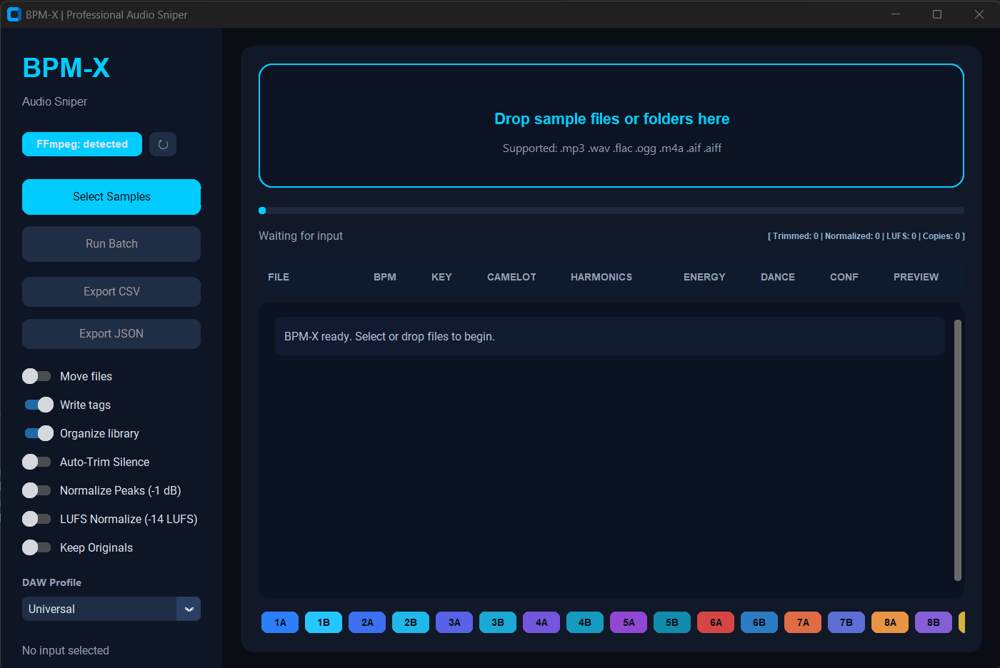

# BPM-X

BPM-X is a Python toolkit that analyzes audio files, detects BPM and key, writes metadata tags, and organizes libraries into a consistent folder structure.

It is designed for practical sample-pack cleanup workflows:
- Analyze BPM and key
- Convert key to Camelot notation
- Tag files with structured metadata
- Organize files with naming templates
- Run full batch workflows from one command

## What It Does

- BPM detection using Librosa-based onset and autocorrelation analysis
- Key detection using chroma features (major/minor output)
- Camelot wheel conversion (1A-12B)
- Metadata writing for MP3, WAV, OGG, FLAC, and M4A (via mutagen)
- Library organization by naming template and destination structure
- Optional GUI mode for desktop workflows

## Project Layout

```text
bpm-x/
  core/          Analysis and translation logic
  modules/       Tagging, organization, audio finishing, energy analysis
  interface/     CLI and GUI entry points
  utils/         Config and logging helpers
  tests/         Test scripts
  docs/          Quickstart, status, and reports
  data/          workspace/ (input) and library/ (organized output)
```

## Requirements

- Python 3.8+
- FFmpeg on PATH (recommended for conversion-heavy workflows)

Install FFmpeg:

```powershell
winget install ffmpeg
```

```bash
brew install ffmpeg
```

## Install

```bash
cd /path/to/bpm-x
python -m venv .venv
source .venv/bin/activate
pip install -r requirements.txt
```

Windows activation:

```powershell
.\.venv\Scripts\Activate.ps1
```

Optional editable install (enables the bpm-x console command):

```powershell
pip install -e .
```

## Run

Two supported ways:

1. Script launcher:

```bash
python main.py --help
python main.py analyze path/to/track.mp3
```

2. Console entry point (after editable install):

```bash
bpm-x --help
bpm-x batch data/workspace --dest data/library --move
```

GUI launch:

```bash
python main.py
```

macOS note: GUI preview can use the built-in `afplay` command when available.

## GUI Preview



If the image does not render, add your screenshot file at `docs/images/gui-home.png` and push again.

## CLI Commands

### analyze

```bash
python main.py analyze file1.mp3 file2.wav --format table
```

Formats: json, table, simple

### tag

```bash
python main.py tag file.mp3 --overwrite
python main.py tag file.mp3 --bpm 128 --key "D Minor"
```

### organize

```bash
python main.py organize data/workspace --dest data/library --move
python main.py organize loop.mp3 --template "{BPM} - {CAMELOT} - {ORIGINAL}"
```

### batch

```bash
python main.py batch data/workspace --dest data/library --move
python main.py batch data/workspace --skip-tag
python main.py batch data/workspace --skip-organize
```

## Configuration

Main settings are in config.yaml. Typical keys:

- library_path
- workspace_path
- naming_template
- audio_sample_rate
- auto_organize
- overwrite_tags
- move_files

## Metadata Notes

BPM-X writes BPM/key metadata into supported tag formats. For maximum portability across tools and file browsers, use filename templates that include BPM and Camelot values.

## Testing

Project includes test utilities under tests/ and status docs under docs/.

Quick checks:

```bash
python tests\test_features.py
python tests\test_audio_generator.py
```

## Known Notes

- Keep MoviePy v1 API compatibility if you rely on moviepy.editor imports.
- On Windows, ImageMagick may be required for TextClip-related workflows.
- On macOS, install FFmpeg with Homebrew before using conversion-heavy workflows.

## Documentation

- docs/QUICKSTART.md
- docs/STATUS.md
- docs/TEST_REPORT.md
- docs/VZN_POLISH_CHANGELOG.md

## License

Add your preferred license file (for example, MIT) before publishing.
